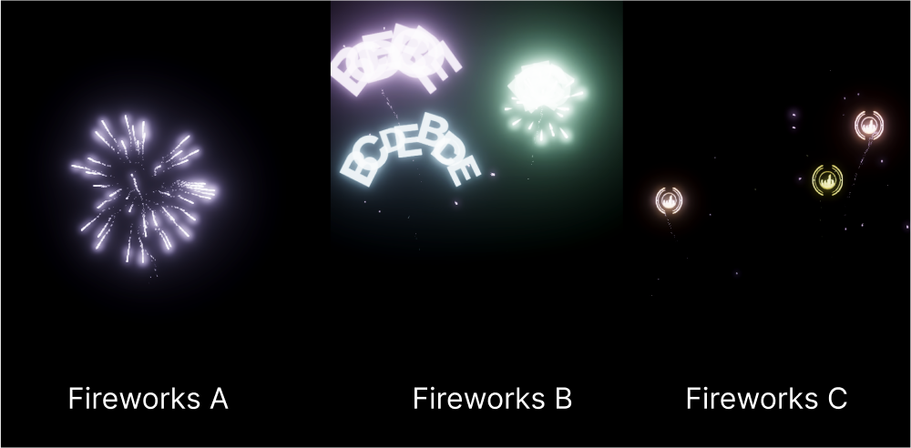

# Zuzaland

An experiment for Mixed Reality land of the Network State

Contributor: 
Amber (bah.eth)
Ada (adacyborg.eth)
Alen (kirinparadise.eth)

Contributor: 
Shibi
Yuchen

## Inspirations  

Where is the network state?
What does it look like? 

Network / Smart contract can be solved by current network infrastructure. 

(1) People communication  (Discord)
(2) Economy  (Token) 
(3) Governance (DAO)

(4) Terrority (Why? )

## What is Zuzaland project

This project aims to launch a collective and interactive digital fireworks display at the closing ceremony. 

During the digital ceremony, a dynamic numeric sculpture hovers at the center surrounded by the event logo. Numerous ribbon-like texts spiral upward from various points on the ground, with their content related to the theme of the event.

Player taps the buttons in the bottom to launch fireworks:

And by creating and joining servers, they can share augmented reality fireworks content. 

There are three types of fireworks available: standard fireworks, conference logo fireworks, and text fireworks support custom text content:

***Using HoloKit hardware enhances the immersion and beauty of the fireworks display***

## Networks
@yuchen

## System requirements

1. Unity 2023.2.0
2. Xcode 15.1

## How to try it

### Build an app

1. Go to: Scenes → Start, open the scene
2. Go to: File File → Build Settings → Build
3. Open Xcode to build app to your mobile device

### Play

1. Please consider the instructions in the section: ***What is Zuzaland project*** as a reference for usage.

## Reference

1. [Get started with Geospatial Creator in Unity](https://www.youtube.com/watch?v=MDcyG9MAMAo)https://www.youtube.com/watch?v=MDcyG9MAMAo
